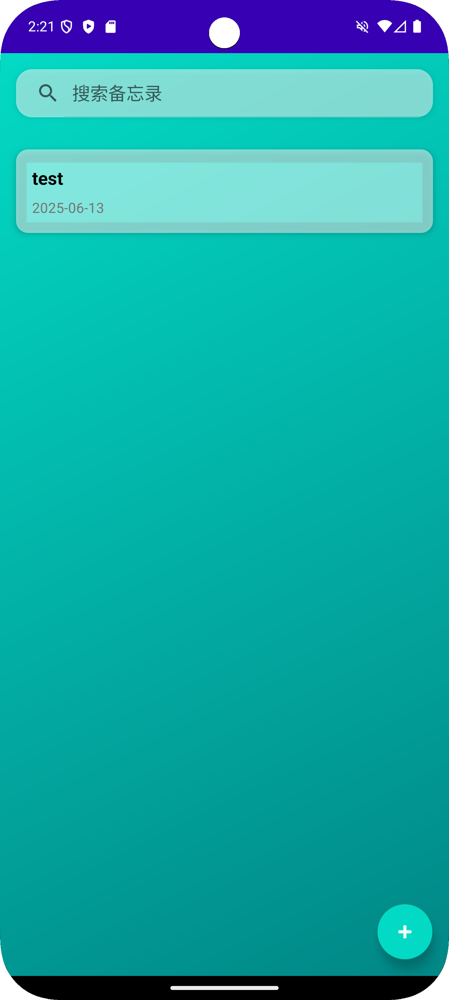

# AndroidMemo - 安卓备忘录应用

一个简洁优雅的安卓备忘录应用，支持文本记录、图片附件和日期管理。



## 功能特性

- 📝 创建、编辑和删除备忘录
- 🖼️ 支持添加图片附件
- 📅 日期管理和显示
- 🔍 支持标题和内容搜索
- 💾 本地数据持久化存储
- 🎨 现代化UI设计
  - 渐变背景
  - 毛玻璃效果
  - Material Design 风格

## 技术栈

- **开发语言**: Kotlin
- **UI框架**: 
  - AndroidX AppCompat
  - Material Design Components
  - ViewBinding
- **架构组件**:
  - Room Database (数据持久化)
  - LiveData (数据观察)
  - Coroutines (异步操作)
- **其他特性**:
  - Activity Result API
  - DatePickerDialog
  - Image Picker

## 系统要求

- Android 5.0 (API 21) 或更高版本
- Android Studio Arctic Fox 或更高版本
- Gradle 7.0 或更高版本

## 安装说明

1. 克隆项目到本地：
```bash
git clone https://github.com/WilliamZ1008/AndroidMemo
```

2. 使用 Android Studio 打开项目

3. 等待 Gradle 同步完成

4. 运行项目到模拟器或实体设备

## 项目结构

```
app/
├── src/
│   ├── main/
│   │   ├── java/com/example/androidmemo/
│   │   │   ├── adapter/          # 适配器类
│   │   │   ├── data/            # 数据层
│   │   │   │   ├── AppDatabase.kt
│   │   │   │   ├── Memo.kt
│   │   │   │   ├── MemoDao.kt
│   │   │   │   └── Converters.kt
│   │   │   └── ui/              # 界面相关
│   │   │       ├── LoginActivity.kt
│   │   │       ├── MemoListActivity.kt
│   │   │       └── MemoEditActivity.kt
│   │   └── res/                 # 资源文件
│   │       ├── layout/          # 布局文件
│   │       ├── drawable/        # 图片资源
│   │       └── values/          # 样式和主题
└── build.gradle.kts            # 应用级构建配置
```

## 使用说明

1. 启动应用后，首先进入登录界面
2. 登录成功后，进入备忘录列表界面
3. 点击右下角的悬浮按钮可以创建新备忘录
4. 点击现有备忘录可以查看和编辑
5. 使用顶部的搜索框可以搜索备忘录
6. 在编辑界面可以：
   - 输入标题和内容
   - 选择日期
   - 添加图片
   - 保存或取消编辑

## 开发说明

### 数据库设计

使用 Room 数据库，主要包含以下表：

- `memos`: 备忘录表
  - id: 主键
  - title: 标题
  - content: 内容
  - date: 日期
  - imagePath: 图片路径

### 主要功能实现

- 使用 ViewBinding 进行视图绑定
- 使用 Coroutines 处理异步操作
- 使用 LiveData 实现数据观察
- 使用 Room 实现数据持久化
- 使用 Activity Result API 处理图片选择

## 贡献指南

1. Fork 项目
2. 创建特性分支 (`git checkout -b feature/AmazingFeature`)
3. 提交更改 (`git commit -m 'Add some AmazingFeature'`)
4. 推送到分支 (`git push origin feature/AmazingFeature`)
5. 创建 Pull Request

## 许可证

本项目采用 MIT 许可证 - 详见 [LICENSE](LICENSE) 文件

## 联系方式

如有问题或建议，请提交 Issue 或 Pull Request。 